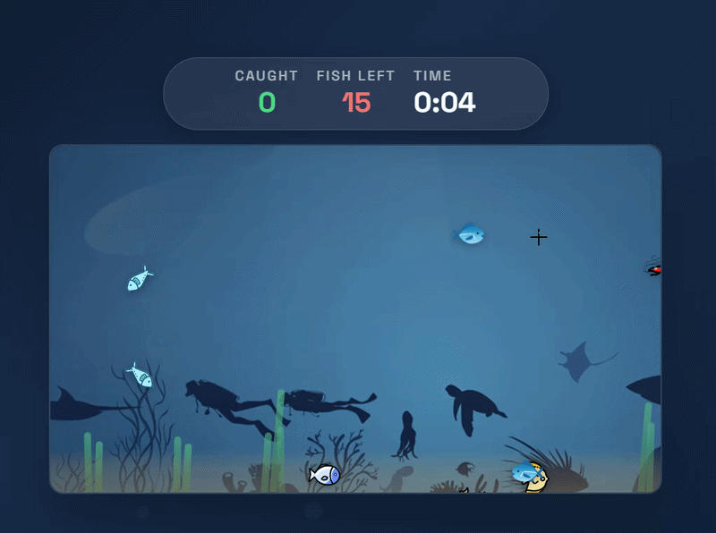

# 🐟 Little Fishies Game
__Vanilla JS game logic, no frameworks__

An interactive browser mini-game where you catch moving fish in a stylized aquarium.
Built with a focus on animation, object behavior, and real-time interaction.

## 🎮 Live Demo

[Click here!](https://little-fishies-game.vercel.app/)

> #### ✨ Features
> 
> - 🐠 Dynamically generated fish with randomized behavior
> - 🌊 Smooth, natural movement (direction changes + wobble effect)
> - 💥 Visual feedback: ripple effect, score popups, confetti
> - ⏱ Timer and score tracking system
> - 🏆 Victory screen with final stats
> - 🎧 Sound effects for interactions
> - 🎨 Detailed UI: lighting, bubbles, seaweed, depth effects

> #### 🛠 Tech Stack
> 
> - Vanilla JavaScript — game logic, animation loop, state management
> - SCSS (Sass) — modular styling and reusable mixins
> - CSS animations & transforms — visual effects
> - DOM API — dynamic element creation and updates

> #### 🧠 Implementation Details
> 
> - Game loop powered by requestAnimationFrame
> - Object-oriented structure (Fish class)
> - Boundary collision and bounce mechanics
> - Randomized speed and movement patterns
> - Centralized game state (start / restart / victory)
> - 📱 Responsiveness

The UI adapts to different screen sizes while keeping the game logic consistent.
The aquarium uses a fixed coordinate system to preserve movement accuracy across devices.

## 🚀 Getting Started
<code>git clone https://github.com/your-username/little-fishies-game.git</code> 
<code>cd little-fishies-game</code>

Open [index.html](https://github.com/asya-space/little-fishies-game/blob/main/index.html) in your browser.

> #### 📌 Possible Improvements
> 
> - Relative positioning instead of fixed coordinates
> - Difficulty levels or game modes
> - Additional fish types with unique behavior
> - Sound settings / toggle

## 💬 About

This project was built as a practice in creating interactive UI and game-like mechanics without external libraries.
The main focus was on animation, behavior modeling, and user interaction.
